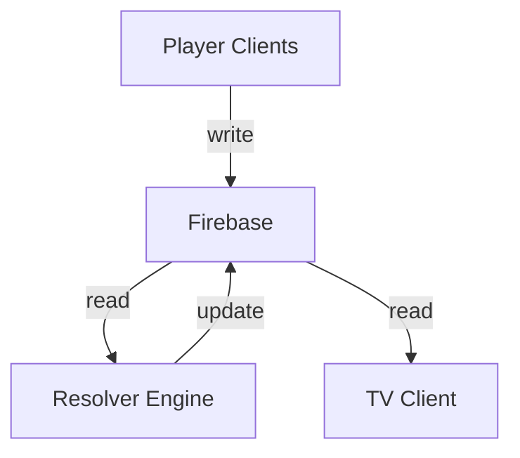
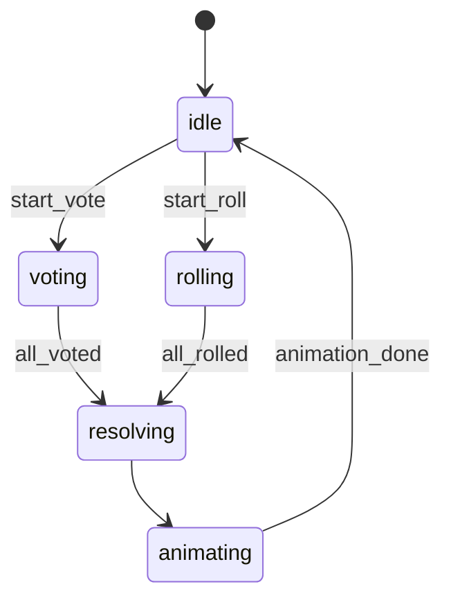
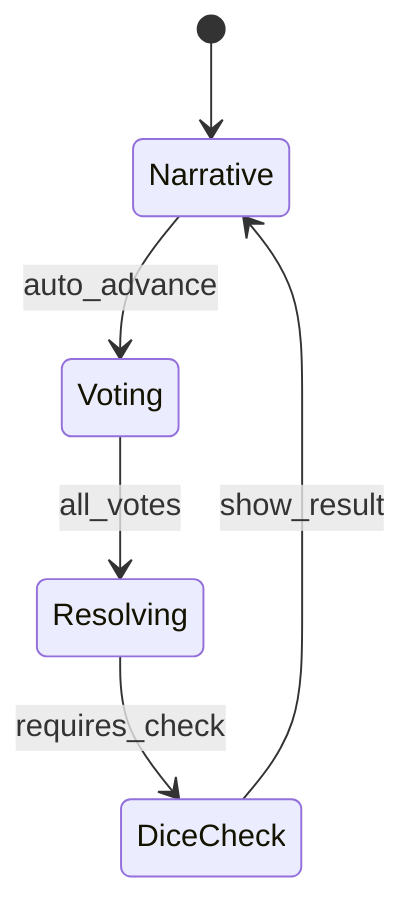
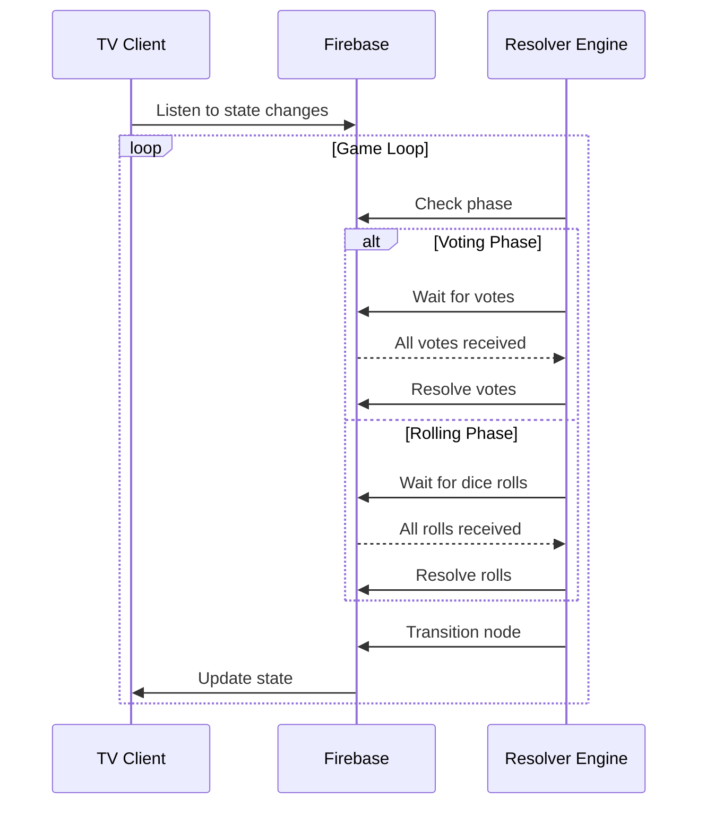

# 📄 PRD: Chrono-Dungeon VTT (Virtual Tabletop)

**Version:** 2.0 (Production-Ready)
**Status:** Ready for AI-Assisted Development
**Platform:** Web (SPA)
**Deployment:** GitHub Pages
**Backend:** Firebase Realtime Database + (Optional) Cloud Functions

---

# 1. Executive Summary

Chrono-Dungeon adalah **state-driven virtual tabletop engine** untuk RPG berbasis JSON yang berjalan secara real-time dengan arsitektur hybrid:

* **TV (Server Display)** → rendering engine (read-only)
* **Mobile (Player Controller)** → input engine (write-controlled)

Sistem ini mengimplementasikan:
👉 **Deterministic Narrative Engine + Real-Time Sync + Event-driven UI**

---

# 2. Success Metrics (MANDATORY)

## North Star Metric

* **Scenario Completion Rate (%)**

## Supporting Metrics

| Metric                | Target     |
| --------------------- | ---------- |
| Avg Session Duration  | > 30 menit |
| Vote Completion Rate  | > 95%      |
| Dice Interaction Rate | > 90%      |
| Drop-off per Node     | < 20%      |
| Firebase Latency      | < 200ms    |

---

# 3. System Architecture

## 3.0 Architectural Diagram



Key:
- Solid arrows: data flow
- Dotted arrows: control flow

---

## 3.1 Authority Model (CRITICAL)

### Flow Control:
1. Player input → Firebase write
2. Firebase trigger → Resolver validation
3. Resolver decision → State update
4. State change → TV render update

### Failure Modes:
- Invalid input: silent reject with client notification
- Race condition: last-write-wins with timestamp check

👉 **Single Source of Truth: Firebase + Server Resolver**

### Decision Authority:

| Action                 | Authority    |
| ---------------------- | ------------ |
| Vote aggregation       | Server Logic |
| Dice result validation | Server       |
| Node transition        | Server       |
| Player input           | Client       |

---

## 3.2 Anti-Cheat Model

* Client boleh generate dice
* Tapi:

  * Server re-validate:

    * range sesuai dice
    * ignore invalid

---

## 3.3 State Machine Model

System menggunakan:

👉 **Finite State Machine (FSM)**



```json
state: {
  current_node,
  status: "idle | voting | rolling | resolving | animating"
}
```

---

# 4. Data Model (FINAL)

```json
rooms: {
  ROOM_PIN: {
    meta: {
      created_at: timestamp,
      status: "waiting | playing | ended",
      scenario_version: "1.0"
    },

    state: {
      current_node: "node_001",
      phase: "voting",
      is_resolving: false
    },

    players: {
      player_id: {
        name,
        class,
        hp,
        status,
        last_roll
      }
    },

    votes: {
      player_id: "option_id"
    },

    dice: {
      player_id: {
        value,
        type,
        timestamp
      }
    }
  }
}
```

---

# 5. Narrative Engine

## 5.0 Flow Diagram



---

## 5.1 Node Types

| Type       | Description   |
| ---------- | ------------- |
| narrative  | auto progress |
| voting     | multi-choice  |
| dice_check | stat check    |
| effect     | visual only   |

---

## 5.2 State Transition Guard (NEW)

```json
allowed_transitions: {
  "node_001": ["node_002", "node_003"]
}
```

---

## 5.3 Execution Flow



---

## 5.4 Timeout System

```json
{
  "timeout": 10000,
  "default": "option_a"
}
```

---

## 5.5 Dice Resolution Logic

```text
IF roll >= difficulty → success
ELSE → fail
```

---

# 6. JSON Schema Validation (CRITICAL)

Gunakan:

* Zod / Yup

---

## 6.1 Schema Example

```ts
NodeSchema = {
  id: string,
  type: enum,
  text: string,
  image: string,
  options?: array,
  on_success?: string,
  on_fail?: string
}
```

---

## 6.2 Validation Rules

* Semua node harus punya ID unik
* Semua target harus exist
* Semua node harus reachable

---

## 6.3 Failure Handling

Jika invalid:

* Stop scenario load
* Show error screen di TV:

  * “Scenario corrupted”

---

# 7. Host Control Layer (NEW)

---

## Role: Host (Optional)

### Capabilities:

* Force next node
* Skip vote
* Reset state
* Kick player
* Override dice

---

## UI:

* Hidden panel di Server (keyboard shortcut)

---

# 8. Player System

---

## 8.1 Session Management

Gunakan:

* sessionStorage

```json
{
  room_pin,
  player_id
}
```

---

## 8.2 Reconnect Flow

```text
LOAD →
CHECK SESSION →
VALIDATE FIREBASE →
RESTORE STATE
```

---

## 8.3 Edge Case

| Case           | Action        |
| -------------- | ------------- |
| Player missing | redirect join |
| Room closed    | exit          |

---

# 9. UI/UX SYSTEM

---

## 9.1 Server (TV)

### Layers:

* Background
* Overlay text
* Player HUD
* Event popup

---

## 9.2 Visual Effects

| Event    | Effect         |
| -------- | -------------- |
| Damage   | Shake          |
| Critical | Red pulse      |
| Dice     | Zoom animation |

---

## 9.3 Asset Strategy (CRITICAL)

---

### Rules:

* Max image size: 500KB
* Format: WebP
* Preload next scene

---

### Cache:

* Service Worker
* IndexedDB (optional)

---

# 10. Error Handling UX

---

## States

| State        | UI                 |
| ------------ | ------------------ |
| Reconnecting | spinner + text     |
| Waiting      | “Menunggu pemain…” |
| Error        | fallback screen    |

---

## Retry Strategy

* Exponential backoff

---

# 11. Firebase Security Rules (MANDATORY)

---

## Rules

* Player hanya boleh write:

  * votes/{player_id}
  * dice/{player_id}

* Tidak boleh:

  * modify players lain
  * modify state

---

# 12. Performance Optimization

---

## Techniques

* Debounce Firebase listener
* Batch updates
* Minimize re-render

---

# 13. Analytics & Logging

---

## Events

```json
{
  "event": "node_enter",
  "node_id": "node_001",
  "timestamp": 123123
}
```

---

## Track:

* Node drop-off
* Vote time
* Dice frequency

---

# 14. Scalability Strategy

---

## Constraints

| Parameter        | Limit |
| ---------------- | ----- |
| Player per room  | 6     |
| Rooms concurrent | 100   |

---

## Cleanup Strategy

* Auto delete room:

  * after 2 hours inactive

---

# 15. Testing Strategy

---

## Required Tests

### Unit

* JSON parser
* dice logic

### Integration

* Firebase sync

### Simulation

* Auto-play scenario

---

# 16. Accessibility

---

* Font min 24px (TV)
* Button min 48px (mobile)
* High contrast mode

---

# 17. Roadmap

---

## Phase 1 — Core Infra

* Firebase setup
* Room system

---

## Phase 2 — Engine

* JSON parser
* State machine

---

## Phase 3 — Interaction

* Voting
* Dice

---

## Phase 4 — Visual

* Animation
* Effects

---

## Phase 5 — Stability

* Reconnect
* Error handling

---

# 18. AI Build Instructions (IMPORTANT)

Ini bagian yang bikin PRD ini “AI-ready”.

---

## 18.1 Folder Structure

```bash
/src
  /components
  /pages
  /hooks
  /store
  /services/firebase
  /engine
```

---

## 18.2 Core Modules

| Module    | Responsibility    |
| --------- | ----------------- |
| engine    | JSON parser + FSM |
| firebase  | sync layer        |
| ui-server | TV rendering      |
| ui-player | mobile UI         |

---

## 18.3 State Store (Zustand)

```ts
useGameStore = {
  currentNode,
  phase,
  players,
  votes
}
```

---

## 18.4 AI Task Breakdown

---

### Task 1

* Setup React + Vite + Tailwind

### Task 2

* Implement Firebase connection

### Task 3

* Build Room System

### Task 4

* Build JSON Engine

### Task 5

* Build Voting System

### Task 6

* Build Dice System